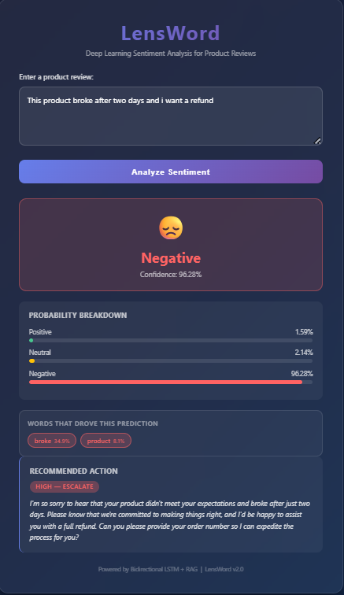
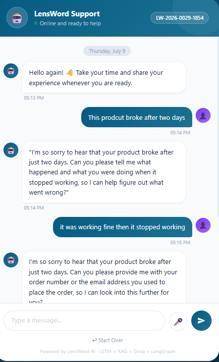

# LensWord 🔍

### Deep Learning Sentiment Analysis for E-Commerce Product Reviews

> **Bidirectional LSTM + RAG-Powered Response System**  
> Built by Betty George & Miheret Woldegabrial — AI/ML Engineering Program, 2026

---

## What is LensWord?

LensWord automatically classifies product reviews as **Positive**, **Neutral**, or **Negative** and uses a RAG system to suggest the most relevant customer service response.

A star rating tells you HOW unhappy a customer is — LensWord tells you **WHY**, **how urgent it is**, and **exactly what to say back**.

---

## Honest Results (3-Seed Mean ± Std)

| Model | Accuracy | Macro F1 |
|---|---|---|
| **LensWord LSTM (mean ± std, 3 seeds)** | **71.88% ± 0.59%** | **0.7201 ± 0.0052** |
| NLPTown (zero-shot) | 72.52% | 0.7115 |
| LiYuan Amazon (zero-shot) | 64.47% | 0.6241 |
| CardiffNLP Twitter (zero-shot) | 60.68% | 0.5399 |

> **Zero-shot caveat:** LensWord was trained on this distribution. HuggingFace models are evaluated zero-shot — they never saw our data or label rules. The Neutral class (3-stars) is defined by our labeling rule and is essentially unknowable to zero-shot models.

### Per-Class F1 (Seed 42)

| Class | F1 Score |
|---|---|
| Negative | 0.7467 |
| Neutral | 0.6396 |
| Positive | 0.7925 |
| **Macro F1** | **0.7263** |

### 3-Seed Results

| Seed | Accuracy | Macro F1 |
|---|---|---|
| 42 | 72.62% | 0.7263 |
| 7 | 71.84% | 0.7205 |
| 123 | 71.17% | 0.7136 |
| **Mean ± Std** | **71.88% ± 0.59%** | **0.7201 ± 0.0052** |

---

## Why Numbers Changed From Earlier Runs

Earlier runs reported 88.85% accuracy and 88.40% Macro F1. Following a 46-page advisor review these figures were found to be inflated due to:

- **Duplicate leakage** — ~6,000 duplicate rows distributed across train and test
- **Vocabulary leakage** — vocabulary fitted on all data including test partition
- **Wrong checkpoint** — model selected on accuracy not Macro F1
- **Invalid SMOTE** — applied to token-index sequences (nominal feature space)

The corrected figures represent honest performance on genuinely unseen, uncontaminated data.

---

## Dual Interface System

### 1. Business Dashboard — `index.html`
For internal business and customer service teams.



- Real-time sentiment classification with color-coded badge
- Confidence score and probability breakdown for all three classes
- Priority level (LOW / MEDIUM / HIGH) from API
- RAG-powered suggested customer service response
- Strong sentiment word override for known model weaknesses

### 2. Customer Chat Interface — `customer.html`
For direct customer interaction.



- Customer submits review naturally
- Sentiment detected silently — customer never sees technical outputs
- Five protection layers including confidence threshold (75%)
- 5-step empathetic conversation flow per sentiment
- Start Over button if wrong flow triggers

---

## Architecture

```
Review text
        ↓
Tokenization → word2idx (4,340 words, fitted on training only)
        ↓
Padding to 50 tokens
        ↓
Embedding Layer [50] → [50, 64]
        ↓
BiLSTM Layer 1 (forward + backward) → [50, 128]
        ↓
BiLSTM Layer 2 → final hidden state [128]
        ↓
Dropout (p=0.4)
        ↓
Fully Connected → [3 logits]
        ↓
Softmax → [3 probabilities]
        ↓
Sentiment + Priority + Action
        ↓
RAG (SentenceTransformer + ChromaDB, 33 entries)
        ↓
Suggested Customer Service Response
```

---

## Project Structure

```
lensword/
├── data/
│   ├── amazon_reviews_cleaned.csv      ← READ ONLY
│   ├── amazon_yelp_combined.csv        ← notebook 02 output
│   ├── test_texts.csv                  ← test rows saved at split time
│   ├── word2idx.pkl                    ← vocabulary (training only)
│   └── *.pt                           ← PyTorch tensors
├── models/
│   ├── lensword_model.pt              ← trained model weights
│   ├── metrics.json                   ← official results (all figures from here)
│   ├── comparison_results.json        ← HuggingFace comparison
│   └── *.png                          ← charts
├── notebooks/
│   ├── 01_EDA_lensword.ipynb
│   ├── 02_preprocessing_lensword.ipynb
│   ├── 03_model_training_lensword.ipynb
│   ├── 04_evaluation_lensword.ipynb
│   └── 05_huggingface_comparison_lensword.ipynb
├── src/
│   ├── api.py                         ← FastAPI + RAG
│   ├── model.py                       ← LensWordLSTM (single definition)
│   ├── config.py                      ← hyperparameters
│   └── knowledge_base.csv            ← 33-entry RAG knowledge base
├── screenshots/
├── reports/
├── Dockerfile
├── .dockerignore
├── index.html                         ← business dashboard
├── customer.html                      ← customer chat
├── requirements.txt
├── LICENSE
└── MODEL_CARD.md
```

---

## Setup Instructions

```bash
git clone https://github.com/BettyG-ship-it/lensword.git
cd lensword
python -m venv venv
venv\Scripts\activate        # Windows
pip install -r requirements.txt
```

Run notebooks in order (01 → 05), then:

```bash
cd src
uvicorn api:app --reload
```

Open `index.html` or `customer.html` in browser. API docs at `http://127.0.0.1:8000/docs`.

### Docker

```bash
docker build -t lensword .
docker run --name lensword-app -p 8000:8000 lensword
```

---

## Key Limitations

- Overfitting — ~21% gap (train 93.55% vs test 72.62%) due to limited data
- Neutral class weakest (F1: 0.6396) — 3-star label is an artifact of our rule
- Negation handling weakness — addressed at application layer via word overrides
- English only
- Local deployment only — HuggingFace Spaces deployment is future work
- No CI/CD pipeline — future work

See `MODEL_CARD.md` for complete limitations list.

---

## Tech Stack

| Layer | Tools |
|---|---|
| Deep Learning | PyTorch — Bidirectional LSTM |
| RAG | ChromaDB + SentenceTransformers (all-MiniLM-L6-v2) |
| API | FastAPI + Uvicorn |
| Frontend | HTML + CSS + JavaScript |
| Containerization | Docker |
| Data | Amazon Alexa Reviews (Kaggle) + Yelp Reviews (HuggingFace) |

---

## Academic Integrity

This project was completed as part of the AI/ML Engineering Program at Apeiron AI Training. Claude AI was used as a learning assistant for guidance, debugging, and concept explanation. All code was written, understood, and executed by the team.

---

## Team

**Betty George** — Co-Lead, AI/ML Engineering Program  
**Miheret Woldegabrial** — Co-Lead, AI/ML Engineering Program


