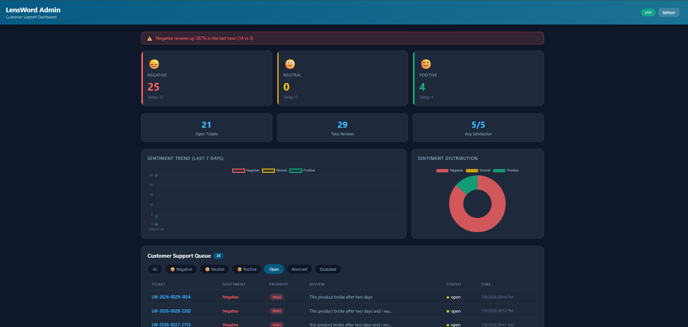
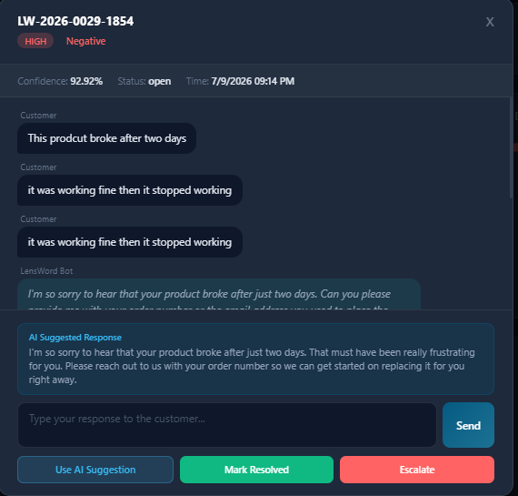

# LensWord

**Deep Learning Sentiment Analysis for E-Commerce Product Reviews**

Built by Betty George and Miheret Woldegabrial
AI/ML Engineering Program, Apeiron AI Training, July 2026

GitHub: github.com/BettyG-ship-it/lensword

---

## What is LensWord?

We built LensWord to solve a real problem. Online stores get thousands of product reviews every day. A 2-star rating tells you a customer is unhappy but it does not tell you why. Was it the product? The shipping? The customer service? Without knowing the reason, you cannot fix the right thing.

LensWord reads each review, figures out the sentiment, tells you how urgent it is, and suggests exactly what to say back. It does all of this automatically so your team can focus on actually helping customers instead of reading through thousands of reviews.

---

## Screenshots

**Business Dashboard -- sentiment analysis with LIME word explanation**


**Customer Chat -- LangGraph conversation in action**


**Admin Dashboard -- live ticket queue with charts**


**Admin Ticket Modal -- agent live chat with customer**


---

## Demo Video

Watch the full system demo: LiveDemo
(https://www.loom.com/share/80fcb0f5cfed401ea120cba5610b4ef9)
---

## What we built

The project has three interfaces serving different audiences.

**Business Dashboard (index.html)** is for managers and customer service teams. You paste a review, it classifies the sentiment with a confidence score, shows the probability breakdown, assigns a priority level, suggests a response, and shows you which words drove the prediction using explainable AI.

**Customer Chat (customer.html)** is for customers submitting feedback directly. They type their review naturally. The system detects the sentiment silently and starts an empathetic conversation. Customers never see any technical output. Negative reviews get a resolution flow. Neutral reviews get a feedback collection flow. Positive reviews get a warm appreciation flow.

**Admin Dashboard (admin.html)** is for customer service agents. It shows real-time sentiment counts with charts, a live ticket queue filtered by sentiment and priority, and lets agents open tickets to chat directly with customers through a live WebSocket connection. Everything is stored in SQLite so nothing gets lost.

---

## How it works

When a customer submits a review, several things happen in sequence.

First, Groq checks if the customer is asking for a human agent. If yes, the ticket is escalated immediately and the admin dashboard gets notified.

If not, Groq checks whether the text is actually a product review. Irrelevant input gets a polite redirect.

Then our BiLSTM model reads the review and classifies it as Negative, Neutral, or Positive. The RAG system finds the most relevant policy from our knowledge base. Groq takes that policy and writes a personalized response using the customer's specific words. LangGraph starts the right conversation flow. Everything gets saved to SQLite with a ticket ID.

The conversation continues turn by turn. Groq watches for sentiment shifts and escalation requests throughout. The admin can jump in at any point through the live chat.

---

## Results

We ran the BiLSTM with three seeds to confirm stability.

| Seed | Test Accuracy | Macro F1 |
|---|---|---|
| 42 | 72.62% | 0.7263 |
| 7 | 71.84% | 0.7205 |
| 123 | 71.17% | 0.7136 |
| Mean and std | 71.88% plus or minus 0.59% | 0.7201 plus or minus 0.0052 |

Per-class F1 for seed 42:

| Class | F1 |
|---|---|
| Negative | 0.7467 |
| Neutral | 0.6396 |
| Positive | 0.7925 |

We also fine-tuned DistilBERT on our dataset (Notebook 06). It handles negation much better than the BiLSTM.

| Model | Accuracy | Macro F1 | Neg F1 | Neu F1 | Pos F1 |
|---|---|---|---|---|---|
| DistilBERT fine-tuned | 80.29% | 0.8082 | 0.8126 | 0.7490 | 0.8630 |
| DistilBERT fine-tuned | 80.29% | 0.8082 |
| NLPTown (zero-shot) | 72.52% | 0.7115 | -- | -- | -- |
| LiYuan (zero-shot) | 64.47% | 0.6241 | -- | -- | -- |
| CardiffNLP (zero-shot) | 60.68% | 0.5399 | -- | -- | -- |

The HuggingFace models are evaluated zero-shot. They never saw our data or our label rules. Our models were trained on this exact distribution so the comparison is not perfectly fair. We state that clearly everywhere.

---

## The data

We combined two datasets. Amazon Alexa Reviews from Kaggle gave us 3,149 reviews. Yelp Reviews from HuggingFace gave us 8,000 sampled reviews. After removing 850 duplicate rows we had 10,299 reviews total.

Split:
- Training: 7,720 reviews
- Validation: 1,544 reviews
- Test: 1,030 reviews

The test set was saved to test_texts.csv at split time and never touched until final evaluation.

## Why numbers changed from earlier runs

Our first pipeline run reported 88.85% accuracy and 88.40% Macro F1. After a full advisor review we found four problems that inflated those numbers.

Duplicate Yelp rows were split across training and test. The model was being tested on reviews it had already seen. We also built the vocabulary before splitting the data, which means test words influenced the vocabulary. We saved the model checkpoint based on accuracy instead of Macro F1, which meant we shipped the most overfit version. And we applied SMOTE to token sequences, which is invalid because token indices are nominal data.

We fixed all four, rebuilt the pipeline from scratch, and the honest results are what you see above. The explanation of what went wrong is more valuable than the inflated number ever was.

---

## Tech stack

| Layer | Technology |
|---|---|
| Sentiment model | PyTorch BiLSTM (444,035 parameters) |
| Fine-tuned model | DistilBERT (66M parameters, Notebook 06) |
| RAG retrieval | ChromaDB plus SentenceTransformer all-MiniLM-L6-v2 |
| LLM responses | Groq llama-3.1-8b-instant |
| Conversation flow | LangGraph (13 nodes) |
| Database | SQLite (3 tables: predictions, messages, alerts) |
| API | FastAPI plus Uvicorn |
| Interfaces | HTML, CSS, JavaScript |
| Live chat | WebSockets |
| Explainability | LIME word importance scores |
| Deployment | Docker (non-root user, HEALTHCHECK) |

---

## Project structure

```
lensword/
├── data/
│   ├── amazon_reviews_cleaned.csv   -- read only after notebook 01
│   ├── amazon_yelp_combined.csv     -- notebook 02 output
│   ├── test_texts.csv               -- test rows saved at split time
│   ├── word2idx.pkl                 -- vocabulary (training only)
│   └── *.pt                        -- PyTorch tensors
├── models/
│   ├── lensword_model.pt            -- BiLSTM weights
│   ├── metrics.json                 -- official BiLSTM results
│   ├── comparison_results.json      -- HuggingFace comparison
│   └── distilbert_comparison.json   -- DistilBERT results
├── notebooks/
│   ├── 01_EDA_lensword.ipynb
│   ├── 02_preprocessing_lensword.ipynb
│   ├── 03_model_training_lensword.ipynb
│   ├── 04_evaluation_lensword.ipynb
│   ├── 05_huggingface_comparison_lensword.ipynb
│   └── 06_distilbert_finetuning_lensword.ipynb
├── src/
│   ├── api.py                       -- FastAPI with all endpoints
│   ├── conversation.py              -- LangGraph state machine
│   ├── database.py                  -- SQLite functions
│   ├── model.py                     -- BiLSTM definition
│   ├── config.py                    -- hyperparameters
│   ├── knowledge_base.csv           -- 33 RAG entries
│   └── .env                        -- Groq key (never committed)
├── screenshots/
│   ├── dashboard.png          -- business dashboard with LIME chips
│   ├── customer_chat.png      -- customer conversation in progress
│   ├── admin_dashboard.png    -- admin ticket queue with charts
│   └── admin_ticket.png       -- agent live chat modal
├── admin.html                       -- admin support dashboard
├── index.html                       -- business dashboard
├── customer.html                    -- customer chat
├── Dockerfile
├── requirements.txt
├── .env.example
├── MODEL_CARD.md
└── README.md
```

---

## Setup

```bash
git clone https://github.com/BettyG-ship-it/lensword.git
cd lensword
python -m venv .venv
.venv\Scripts\activate
pip install -r requirements.txt
```

Create `src/.env` with your Groq API key:
```
GROQ_API_KEY=your-groq-key-here
```

Run notebooks 01 through 05 in order. Then:

```bash
cd src
uvicorn api:app --reload
```

Open `index.html`, `customer.html`, or `admin.html` in your browser.
API docs at `http://127.0.0.1:8000/docs`.

---

## Docker

```bash
docker build -t lensword .
docker run -e GROQ_API_KEY=your-key -p 8000:8000 lensword
```

---

## Protection guards

LensWord has 18 protection guards across four layers to handle bad input, weak predictions, escalations, and security threats. These cover empty input, out-of-domain text, low confidence predictions, strong word overrides, SQL injection prevention, and Docker security.

## Known limitations

The BiLSTM struggles with negation. "I hate this product" was sometimes classified as Positive because "hate" appeared rarely in our training data. We handle this at the application layer with word overrides and confidence thresholds. DistilBERT fine-tuning fixes it properly at the model level.

Neutral is our weakest class (F1: 0.6396). Three-star reviews are genuinely ambiguous and our label rule defines Neutral as exactly three stars, which zero-shot models cannot know.

The knowledge base has 33 entries. A production system would need hundreds based on real customer service logs.

The system only handles English reviews. Vocabulary size is 4,340 words fitted on training data only. Rare words become unknown tokens.

---

## Academic integrity

This project was completed as part of the AI/ML Engineering Program at Apeiron AI Training. We used Claude AI as a learning assistant for guidance, debugging, and explanations. All code was written, understood, and run by us.

---

Betty George and Miheret Woldegabrial
AI/ML Engineering Program, Apeiron AI Training, July 2026
